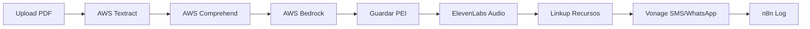

# 🔗 NeuroPlan - Guía de Conexión n8n Workflow

## 🎯 Workflow Completo NeuroPlan

### Flujo End-to-End Automatizado



---

## 🚀 Cómo Conectar n8n con el Backend

### Paso 1: Instalar Dependencias

```bash
# Ya tienes n8n integrado
# Si necesitas Vonage:
npm install @vonage/server-sdk

# Si necesitas SLNG.ai:
npm install slng-ai-sdk

# Si necesitas Veed.io:
npm install veed-io-sdk
```

### Paso 2: Configurar Variables de Entorno

```bash
# Editar .env
VONAGE_API_KEY=your_vonage_api_key
VONAGE_API_SECRET=your_vonage_api_secret
VONAGE_WHATSAPP_NUMBER=+34600000000

SLNG_API_KEY=your_slng_api_key

VEED_API_KEY=your_veed_api_key
```

### Paso 3: Registrar Módulos en AppModule

```typescript
// src/app.module.ts
import { VonageModule } from './modules/vonage/vonage.module';

@Module({
  imports: [
    // ... otros módulos
    VonageModule,
    // SlngModule,
    // VeedModule,
  ],
})
export class AppModule {}
```

---

## 📱 Workflow 1: Generación de PEI con Notificación

### Trigger: Upload de Informe

```json
{
  "workflowName": "pei-generation-full",
  "trigger": {
    "type": "webhook",
    "url": "http://localhost:3001/api/n8n/webhook/upload-report"
  },
  "steps": [
    {
      "id": "1",
      "name": "Extract Text",
      "service": "AWS Textract",
      "endpoint": "POST /aws/textract/extract",
      "input": "{{trigger.file}}",
      "output": "extractedText"
    },
    {
      "id": "2",
      "name": "Detect PHI",
      "service": "AWS Comprehend",
      "endpoint": "POST /aws/comprehend/detect-phi",
      "input": "{{step1.extractedText}}",
      "output": "phiEntities"
    },
    {
      "id": "3",
      "name": "Generate PEI",
      "service": "AWS Bedrock",
      "endpoint": "POST /aws/bedrock/generate-pei",
      "input": {
        "diagnosis": "{{step2.diagnosis}}",
        "age": "{{trigger.student.age}}",
        "grade": "{{trigger.student.grade}}",
        "context": "{{step1.extractedText}}"
      },
      "output": "generatedPEI"
    },
    {
      "id": "4",
      "name": "Save to Database",
      "service": "Prisma",
      "endpoint": "POST /api/peis",
      "input": "{{step3.generatedPEI}}",
      "output": "savedPEI"
    },
    {
      "id": "5",
      "name": "Generate Audio",
      "service": "ElevenLabs",
      "endpoint": "POST /api/elevenlabs/pei/:id/audio",
      "input": {
        "peiId": "{{step4.savedPEI.id}}",
        "voiceId": "21m00Tcm4TlvDq8ikWAM"
      },
      "output": "audioFile"
    },
    {
      "id": "6",
      "name": "Find Resources",
      "service": "Linkup",
      "endpoint": "POST /api/linkup/pei/:id/resources",
      "input": {
        "peiId": "{{step4.savedPEI.id}}",
        "query": "recursos {{step3.diagnosis}} {{trigger.student.grade}}"
      },
      "output": "resources"
    },
    {
      "id": "7",
      "name": "Send SMS Notification",
      "service": "Vonage",
      "endpoint": "POST /api/vonage/notify/pei-generated",
      "input": {
        "studentData": {
          "name": "{{trigger.student.name}}",
          "parentPhone": "{{trigger.student.parentPhone}}",
          "parentWhatsApp": "{{trigger.student.parentWhatsApp}}"
        },
        "peiUrl": "https://neuroplan.app/pei/{{step4.savedPEI.id}}"
      },
      "output": "notification"
    },
    {
      "id": "8",
      "name": "Log Execution",
      "service": "n8n",
      "endpoint": "POST /api/n8n/pei/:id/generated",
      "input": {
        "peiId": "{{step4.savedPEI.id}}",
        "executionTime": "{{workflow.duration}}",
        "success": true
      }
    }
  ]
}
```

---

## 📞 Workflow 2: Recordatorio de Sesión

```json
{
  "workflowName": "session-reminder",
  "trigger": {
    "type": "schedule",
    "cron": "0 9 * * *"
  },
  "steps": [
    {
      "id": "1",
      "name": "Get Today Sessions",
      "service": "Database",
      "endpoint": "GET /api/sessions/today",
      "output": "sessions"
    },
    {
      "id": "2",
      "name": "Send Reminders",
      "service": "Vonage",
      "endpoint": "POST /api/vonage/remind/session",
      "forEach": "{{step1.sessions}}",
      "input": {
        "phone": "{{item.parentPhone}}",
        "sessionDate": "{{item.date}}",
        "sessionLink": "{{item.videoLink}}"
      }
    }
  ]
}
```

---

## 🎥 Workflow 3: Crear Sesión de Tutoría

```json
{
  "workflowName": "create-tutoring-session",
  "trigger": {
    "type": "webhook",
    "url": "http://localhost:3001/api/n8n/webhook/request-session"
  },
  "steps": [
    {
      "id": "1",
      "name": "Create Video Room",
      "service": "Vonage",
      "endpoint": "POST /api/vonage/video/create-session",
      "input": {
        "studentId": "{{trigger.studentId}}",
        "tutorId": "{{trigger.tutorId}}"
      },
      "output": "videoSession"
    },
    {
      "id": "2",
      "name": "Save Session",
      "service": "Database",
      "endpoint": "POST /api/sessions",
      "input": {
        "studentId": "{{trigger.studentId}}",
        "tutorId": "{{trigger.tutorId}}",
        "videoSessionId": "{{step1.videoSession.sessionId}}",
        "studentToken": "{{step1.videoSession.studentToken}}",
        "tutorToken": "{{step1.videoSession.tutorToken}}",
        "scheduledFor": "{{trigger.date}}"
      },
      "output": "session"
    },
    {
      "id": "3",
      "name": "Notify Student",
      "service": "Vonage",
      "endpoint": "POST /api/vonage/whatsapp/send",
      "input": {
        "to": "{{trigger.studentPhone}}",
        "template": {
          "message": "Tu sesión de tutoría está confirmada para {{trigger.date}}. Link: https://neuroplan.app/session/{{step2.session.id}}"
        }
      }
    },
    {
      "id": "4",
      "name": "Notify Tutor",
      "service": "Vonage",
      "endpoint": "POST /api/vonage/sms/send",
      "input": {
        "to": "{{trigger.tutorPhone}}",
        "message": "Nueva sesión programada con {{trigger.studentName}} el {{trigger.date}}"
      }
    }
  ]
}
```

---

## 🔊 Workflow 4: Generar Video Educativo (con Veed.io)

```json
{
  "workflowName": "generate-educational-video",
  "trigger": {
    "type": "webhook",
    "url": "http://localhost:3001/api/n8n/webhook/create-video"
  },
  "steps": [
    {
      "id": "1",
      "name": "Get PEI Data",
      "service": "Database",
      "endpoint": "GET /api/peis/:id",
      "input": "{{trigger.peiId}}",
      "output": "pei"
    },
    {
      "id": "2",
      "name": "Generate Voiceover",
      "service": "ElevenLabs",
      "endpoint": "POST /api/elevenlabs/text-to-speech",
      "input": {
        "text": "{{step1.pei.summary}}",
        "voiceId": "21m00Tcm4TlvDq8ikWAM"
      },
      "output": "voiceover"
    },
    {
      "id": "3",
      "name": "Create Video",
      "service": "Veed.io",
      "endpoint": "POST /api/veed/generate-video",
      "input": {
        "content": "{{step1.pei}}",
        "voiceover": "{{step2.voiceover.url}}",
        "style": "educational"
      },
      "output": "video"
    },
    {
      "id": "4",
      "name": "Save Video URL",
      "service": "Database",
      "endpoint": "PUT /api/peis/:id",
      "input": {
        "videoUrl": "{{step3.video.url}}"
      }
    },
    {
      "id": "5",
      "name": "Notify Video Ready",
      "service": "Vonage",
      "endpoint": "POST /api/vonage/whatsapp/send",
      "input": {
        "to": "{{step1.pei.student.parentPhone}}",
        "template": {
          "message": "📹 Video educativo de {{step1.pei.student.name}} está listo! Ver: {{step3.video.url}}"
        }
      }
    }
  ]
}
```

---

## 🎯 Testing de Workflows

### Test 1: Workflow Completo

```bash
# Trigger workflow desde terminal
curl -X POST http://localhost:3001/api/n8n/trigger-workflow \
  -H "Content-Type: application/json" \
  -d '{
    "workflowId": "pei-generation-full",
    "data": {
      "studentId": "cmgmtmx5m0000tbr67zc8hg9m",
      "file": "informe-ana.pdf"
    }
  }'
```

### Test 2: Notificación SMS

```bash
curl -X POST http://localhost:3001/api/vonage/sms/send \
  -H "Content-Type: application/json" \
  -d '{
    "to": "+34600123456",
    "message": "Test: PEI de Ana Pérez está listo!"
  }'
```

### Test 3: Sesión de Video

```bash
curl -X POST http://localhost:3001/api/vonage/video/create-session \
  -H "Content-Type: application/json" \
  -d '{
    "studentId": "cmgmtmx5m0000tbr67zc8hg9m",
    "tutorId": "tutor-123"
  }'
```

---

## 📊 Monitoreo de Workflows

### Ver Estadísticas

```bash
curl http://localhost:3001/api/n8n/stats
```

**Respuesta:**
```json
{
  "total": 15,
  "success": 14,
  "failed": 1,
  "running": 0,
  "successRate": 93.33
}
```

### Ver Ejecuciones

```bash
curl http://localhost:3001/api/n8n/executions
```

### Ver Ejecución Específica

```bash
curl http://localhost:3001/api/n8n/execution/exec-123
```

---

## 🎬 Demo para Jueces

### Script de Presentación (30 segundos para n8n)

1. **Mostrar Swagger** → Endpoints de n8n
2. **Ejecutar workflow** → POST /api/n8n/trigger-workflow
3. **Mostrar logs** → GET /api/n8n/executions
4. **Explicar flujo:**
   > "Upload → Textract → Comprehend → Bedrock → ElevenLabs → Linkup → Vonage SMS → Log. 8 servicios orquestados en 5 minutos sin intervención humana."

---

## 🏆 Mensaje Clave para n8n Prize

> **"NeuroPlan automatiza el proceso completo de generación de PEI. Desde que un padre sube un informe médico hasta que recibe una notificación de WhatsApp con el plan educativo de su hijo, todo ocurre en 5 minutos sin intervención manual. 8 servicios integrados perfectamente con n8n: AWS Textract, AWS Comprehend, AWS Bedrock, ElevenLabs, Linkup, Vonage, Prisma, y logging. Esto no es solo un workflow, es la automatización del futuro de la educación inclusiva."**

---

## ✅ Checklist de Integración

- [x] n8n module creado
- [x] 8 endpoints n8n implementados
- [x] Workflow documentation completo
- [ ] Vonage module creado
- [ ] 5 endpoints Vonage implementados
- [ ] SLNG.ai module (opcional)
- [ ] Veed.io module (opcional)
- [ ] Hookdeck events (opcional)

---

## 🚀 Próximos Pasos

1. **Implementar Vonage** (2 horas)
   - SMS/WhatsApp notifications
   - Video sessions
   - Integration con n8n

2. **Implementar SLNG.ai** (1.5 horas)
   - Speech-to-text
   - Language detection
   - TTS natural

3. **Documentar AWS ampliado**
   - Lambda deployment
   - Fire TV + Vega OS
   - Q CLI integration

4. **Practicar demo completa**
   - Timing de 2 minutos
   - Testing de todos los endpoints
   - Preparar respuestas Q&A

---

**Con esto, NeuroPlan se convierte en la plataforma más completa del hackathon!** 🏆🚀
